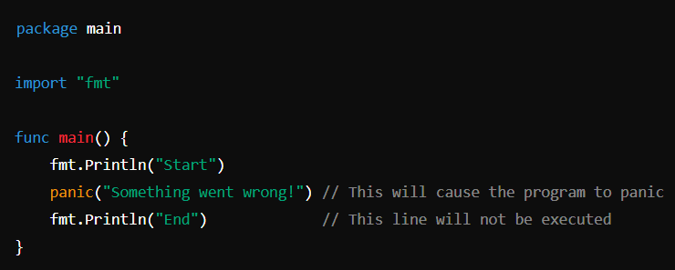

# Files

### panic

- panic is used to handle unexpected errors or situations that should not happen during normal operation. 
- When panic is called, the program stops running and starts cleaning up by calling any deferred functions. 
- After that, the program crashes with an error message.\
  

# writing

- io package is used for writing in a text file

# reading

- ioutils package is used for reading from a file. 
- content of files are read in byte format
- There are differnet ways to convert byte to string-
  - string(data-byte-variable)
  - 