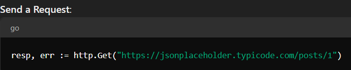
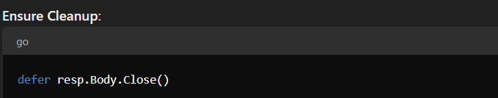
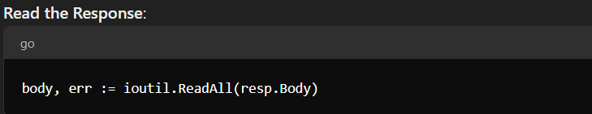
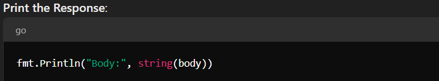

# net/http Package

[The net/http Package - Medium Article](https://medium.com/@emonemrulhasan35/net-http-package-in-go-e178c67d87f1)

This package provides many functionality to work with HTTP. Such as
- Building Web Servers
- Handling web requests and responses
- Implementing middleware and authentication
- Serving static files and content

## [type Response](https://pkg.go.dev/net/http#Response)

In the Go net/http package, http.Response is a structure that represents the response from an HTTP request. \
This type contains various fields that provide information about the response received from the server.

The http.Response in Go is like a report card you get after making a request to a website. Here's what it contains:
- Status: This tells you how well the request went, like "200 OK" (everything's good) or "404 Not Found" (the page isn't there).
- StatusCode: This is a number version of the status, like 200 or 404.
- Header: These are like extra notes from the website, giving you more information about the response.\
  Headers are present in both HTTP requests and HTTP responses in the Go net/http package. \
  In an HTTP request, headers provide additional information about the request being made, such as content type, user agent, and authentication details. In an HTTP response, headers provide information about the response received, such as content type, status, and server details.\
- Body: This is the actual content you asked for, like the text of a webpage or data.
- ContentLength: This tells you how big the body is.
- Close: This tells whether the connection should be closed after getting the response.
- Request: This shows what request was sent to get this response.
- TLS: This gives details if the response used a secure connection.

## [type Request](https://pkg.go.dev/net/http#Request)

### Key Fields of http.Request

- Close - It is a type of boolean field in "http.Request" struct. When Close is set to true, it indicates that the HTTP client should close the connection after completing the request, rather than keeping it open for potential reuse.

**Basically it means that whether you make a Read Reqeust or Write request, it never closes the connection.**

### Why do we need to close the Request?

In Go, when making HTTP requests, it's important to close the response body to free up resources. The defer resp.Body.Close() statement ensures that the response body is properly closed after all operations are done, preventing resource leaks and ensuring the connection is properly terminated.

Simple Explanation

- When you send a request to a website, the website sends back a response. This response is like an open file or a phone call. If you don't hang up the phone or close the file when you're done, it can cause problems. Closing the response:
  - Frees Up Resources: It makes sure your computer or server doesn't run out of memory or connections.
  - Prevents Memory Leaks: If you keep leaving things open, your program could eventually run out of resources and crash.
  - Proper Cleanup: Ensures that everything is cleaned up correctly after you're done using the response.

### Examples
   
   
   
   