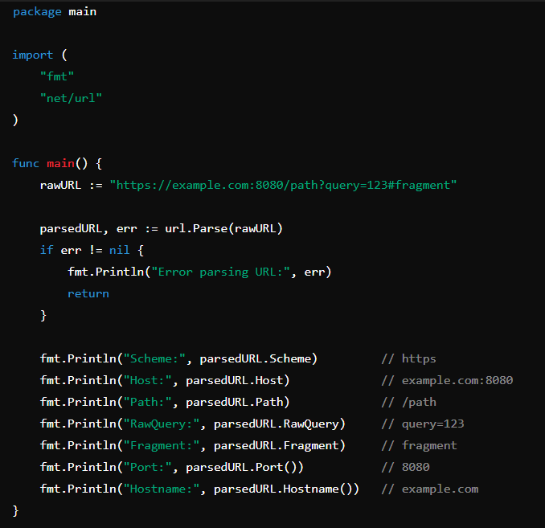
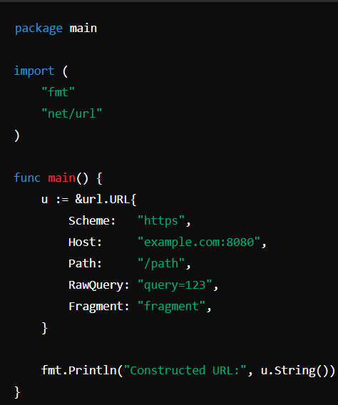
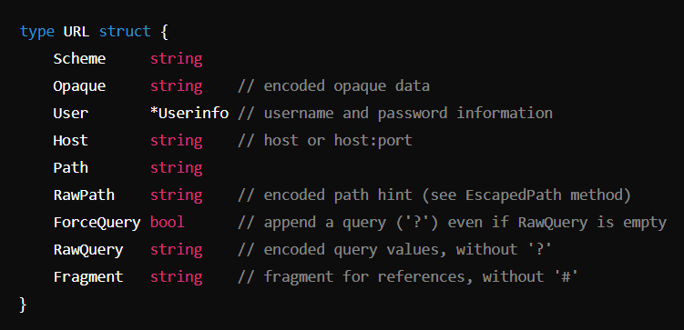

# URL Parsing

### 1. Using url.Parse()

- Parsing basically means to resolve into components
- URL Parsing means to divide the URL into the components
- "net/url" package helps a lot with built-in methods and property.

#### Scheme
- http
  
#### Host
- host or host:port (see Hostname and Port methods)
  
#### Path
- path (relative paths may omit leading slash)
  
#### Port()
- port number

### 2. Using Query Parameter
- You can also parse and manipulate the query parameters of a URL. 
- The url.Values type provides convenient methods for working with query parameters. 
- parsedURL.Query() returns the query parameters as a url.Values map.
- You can access, modify, and add query parameters using the methods provided by url.Values.
- parsedURL.RawQuery = queryParams.Encode() updates the URL with the modified query parameters.

### 3. Constructing a URL

  output - https://example.com:8080/path?query=123#fragment
- A url.URL struct is created and its fields are set to construct a URL.
- u.String() returns the complete URL as a string.

In Go, the &url.URL expression creates a pointer to a url.URL struct. The url.URL struct represents a parsed URL and provides various fields to access different components of the URL.

Structure of url.URL

Each field in the url.URL struct represents a specific part of a URL. Here’s what each field means:

Scheme: The protocol (e.g., "http", "https").
Opaque: Opaque data, mainly used in non-hierarchical URLs.
User: Username and password information (optional).
Host: The host or host
(e.g., "example.com" or "example.com:8080").
Path: The path of the URL (e.g., "/path").
RawPath: The encoded path hint.
ForceQuery: A flag to append a query ('?') even if RawQuery is empty.
RawQuery: The encoded query values (e.g., "query=123").
Fragment: The fragment identifier (e.g., "fragment")

When you create a pointer to a url.URL, you are working with the address of the struct rather than a copy of it. This is useful when you want to modify the original URL or pass it around without making copies.